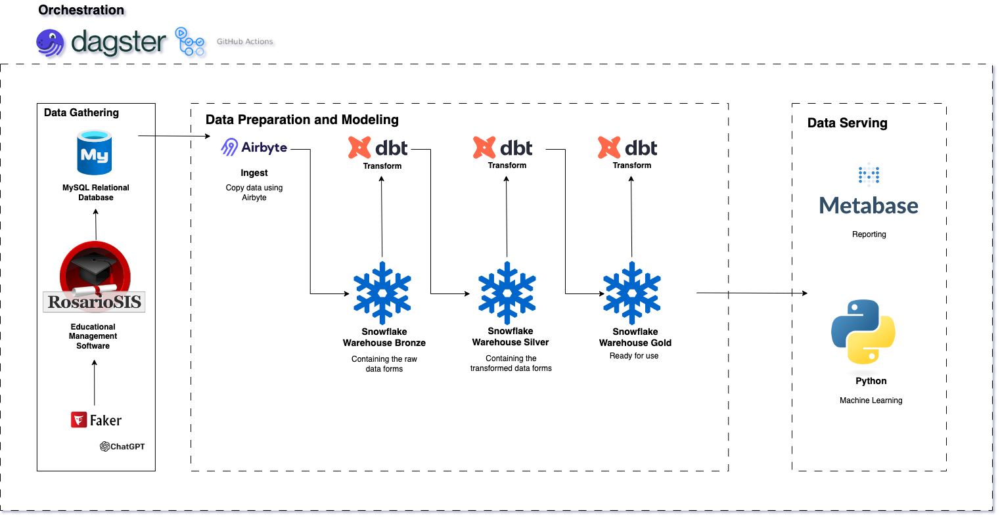
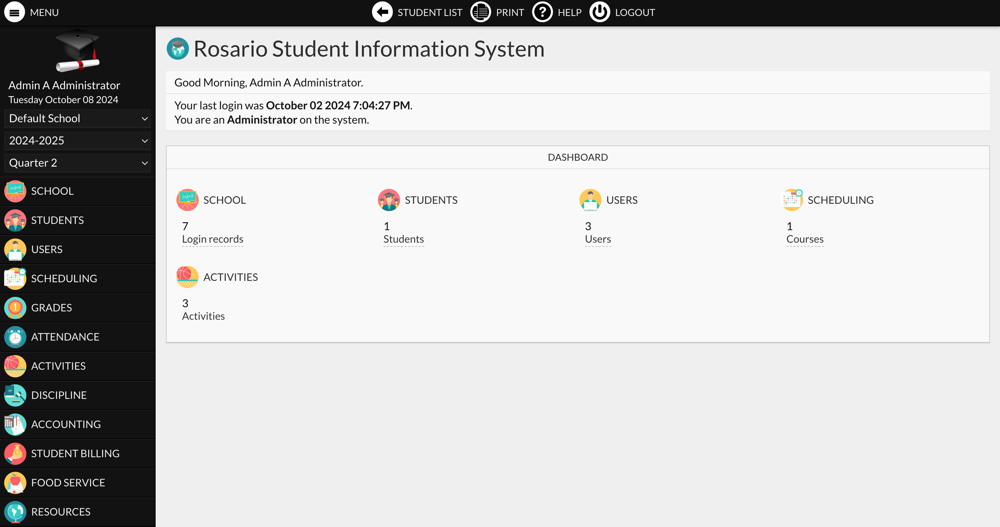
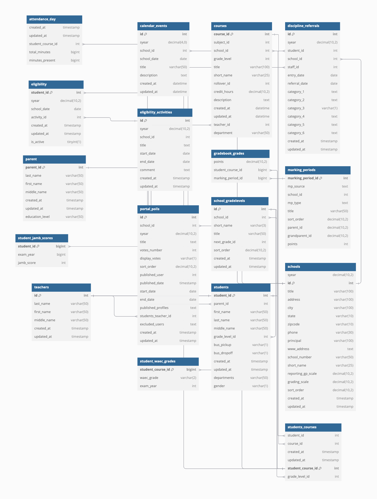
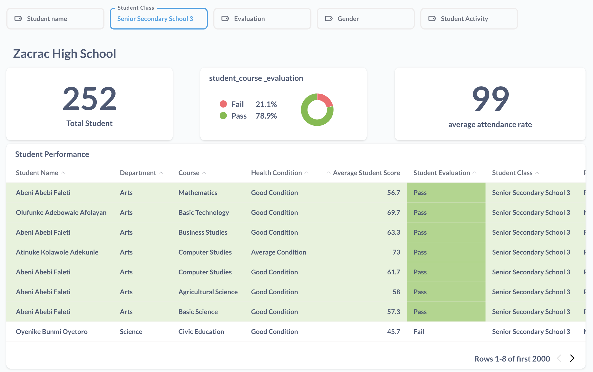
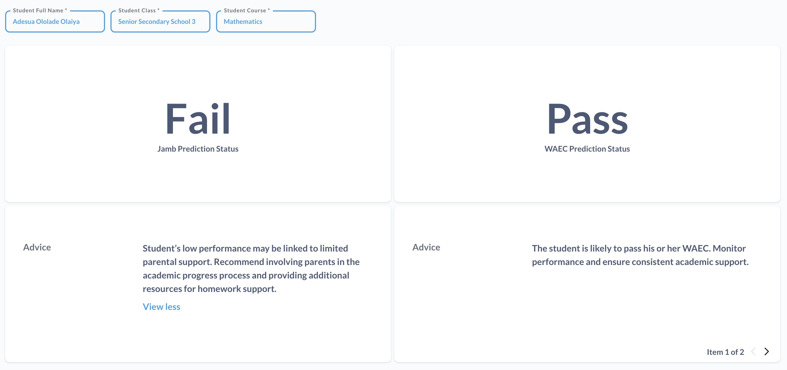



# Project Documentation

This project is an end-to-end solution built by the Data Baddies team for the DatafestAfrica 2024 Datathon comprising of [Olaminike Olaiya](https://www.linkedin.com/in/olaminike-olaiya-821b66224/), the data scientist, and [Nancy Amandi](https://www.linkedin.com/in/nancy-amandi/), the data engineer.

# Problem Statement

Zacrac High School, a secondary school in Lagos, Nigeria, is concerned that its students may contribute to the high percentage of poor performance in nationwide exams, especially the 76% JAMB failure rate in 2024. To address this, the school aims to closely monitor student performance by adopting a more proactive approach. By predicting exam scores, they plan to implement targeted recommendations and adjust school activities to improve future outcomes.

Upon reviewing the situation, it became evident that the school also faces a significant challenge with data collection. Their records are scattered across various locations in paper formats, and no central electronic system is in place.

This is where the Data Baddies team steps in! We’re excited to guide Zacrac High School on its journey to solving these problems. Stick with us as we walk you through our process and solutions. We're excited to show you how we tackled this—let’s get started!

# Solution Approach

- Data Gathering: Rosariosis Software and MySQL database

- Data Ingestion: Airbyte

- Data Storage: Snowflake

- Data Preparation and Modeling: dbt

- Machine Learning: Python

- Reporting and Visualization: Metabase

- Pipeline Orchestration: Dagster

While choosing this solution approach and the tools involved, we considered several factors:

- Cost-effectiveness: We understood that this was a secondary school so most of the tools used has open source versions where the school didn’t need to pay for subscription fees. These included: Rosariosis software, Airbyte, dbt, Dagster.

- Scalability: To aid scalability, we needed to orchestrate all the processes involved. Hence, we chose to use an orchestration tool. In addition, to solve the problem of recording data for the school, we setup a software so that they won’t need to use paper data records anymore. This approach also aids our data ingestion process for the data pipeline.

- Data volume and velocity: For a secondary school, it is expected that data points are recorded at least five times in a week. This prompted us to set up a data ingestion tool to capture all data generated in the school.

- Business requirements: it is required that the school should be able to predict students’ scores in upcoming exams so a visualization tool was used to aid this process.

- Data formats: Because the raw data was already in a structured format, we chose a warehouse (not a data lake or lakehouse) to store the data.

- No complex transformation involved: There were no complex transformations involved in the data processing so we chose to use dbt that is built on the basis of SQL.

## Data Gathering

To address the issue of scattered written school records that risk being lost, we introduced Zacrac High School to RosarioSIS, an open-source educational management system. RosarioSIS helps schools maintain electronic records by syncing data into a transactional database. The best part? There’s no licensing fee. Here’s how it works:

- Cost-Effective: The school only needs to cover the cost of integration, hosting services (to keep the system running 24/7), and an administrator for data entry—no expensive software licenses are required.

- User-Friendly: Teachers can be added as users to record activities related to their subjects and students, streamlining the process of managing classroom data.

- Customizable: The software is fully customizable, allowing the school to add new modules and tailor the system to meet its unique needs.

- Multi-School Support: RosarioSIS allows multiple schools to share the same hosting resources while keeping their data separate. Zacrac High School can collaborate with other schools, reducing hosting costs even further.

This system will help Zacrac High School secure its records and manage its data more efficiently, ensuring smoother day-to-day operations and better performance tracking.

Setting up the Rosariosis software automatically created tables in the linked database. These tables gave us the basis of the kind of information needed in a secondary school. However, because these tables were plenty and more than 80 tables, we decided to use some tables that were relevant to this project. Our choice of tables was mostly associated with the day-to-day activities of the school.

Below is the list of tables we chose and their short descriptions:

- attendance_day: Contains the attendance of students

- calendar events: Contains events and public holidays that the school hosted or participated in

- courses: Contains the subjects offered in the school

- discipline_referrals: Contains offenses and punishments of delinquent students

- eligibility: Contains the eligibility of students as regards extracurricular activities

- eligibility activities: Contains the extracurricular activities of students

- gradebook_grades: Contains the scores of students of various assessment types

- marking_periods: Contains the periods at which students are assessed. Eg. First term Midterm test

- parent: Contains the list of parents that have children in the school

- portal_polls: Contains the voting polls of students in evaluating their teachers

- school_gradelevels: Contains the different classes in the school. In this context, JSS1 to SS3

- schools: Contains a list of schools. In this context, only one school (Zacrac High School) is in the table.

- student_jamb_scores: Contains the jamb scores of the alumni students

- student_waec_grades: Contains the waec grades of the alumni students

- students: Contains students and their information in the school

- students_course: Contains students and the courses they studied and/or are studying.

- teachers: Contains teachers in the school

It is important to note that some of these tables were added for the sake of this project. The tables include student_jamb_scores and student_waec_grades. 

The image below is the Entity Relationship Diagram between the tables in the database. 

To further explore the tables and their relationships in the diagram, you can visit [this link](https://dbdocs.io/amandinancy16/OLTP-ERD-Diagram-DatafestAfrica).

*When you visit the link, you can click on each table at the left menu to see the tables related to your selected table.*

Having most of our tables already generated by the Rosariosis software in our database, we went forward to generate pseudo data using a combination of ChatGPT and the Python Faker Library. While doing this, we considered several factors:

- General statistics of students' performance in WAEC and JAMB during the alumni years used in our data (2029, 2020 and 2021). This impacted the actual WAEC and JAMB grades allocated to each student.

- The decline in jamb registration of students across chosen years. Not all students in the class will register for JAMB

- The Nigerian school culture of the same teachers teaching multiple similar courses

- Three major kinds of assessments are done in secondary schools: principal tests taken at the beginning of each term, midterm tests taken at the middle of each term, and final exams taken at the end of each term. This made us divide the students’ scores based on their marking periods.

- The registered students in grade level 1 (JSS1) to grade level 6 (SS3) are in the current session of the 2022 first term (our assumed current session year). Hence, their historical assessment records were generated for their previous years

- Students in grade levels 7, 8, and 9 are alumni for 2021, 2020, and 2019 respectively. Their past internal exam records were also generated from their grade level 1 to grade level 6

- A parent can have multiple children in a school so in our database, multiple students can have the same parents.

- A delinquent student can commit different offences at different periods

## Data Ingestion

Data was ingested using the cloud version of Airbyte. We chose the cloud version that had 14-day free trial because we didn’t want to waste time in setting up the open-source version of the application. 

It is important to note that we didn’t move one of our tables using Airbyte (gradebook_grades). 

Instead, we used the manual process of using python to move it to a Snowflake Stage and then moved the data in the Stage to the RAW schema of the warehouse. 

We chose this route because after using Python Faker Library to generate the data of about 21 million rows, We couldn’t move it directly to our database on Google Colab because of RAM exhaustion issues. 

However, in a real setting there won’t be a need for this because as soon as the data is recorded through the Rosariosis Software, it is entered into the hosted database linked to the software.

## Data Storage

Snowflake was used as the warehouse due to the structured format of the raw data. It consisted of the RAW, INTERMEDIATE, AND CORE schemas. 

The RAW schema contains raw tables copied from the transactional database to the warehouse. The INTERMEDIATE schema contains the transformed forms of each of these tables. The CORE schemas contain tables that were as a result of re-modeling or joining with other tables in the INTERMEDIATE schema. It also contains the two aggregate tables that were used for the machine-learning process.

## Data Preparation and Modeling

The tables in the Snowflake INTERMEDIATE and CORE schemas were built using dbt, our transformation tool. The major data preparation techniques used were:

- Dropping of duplicates

- Handling null values

- Casting columns to suitable datatypes

- Derivation of some columns

- Joining some tables into one table

- Generation of dates dimension table to aid analysis

- Dropping irrelevant columns

- Creating the Jamb ML Data (jamb_performance_metrics table) and WAEC ML Data (waec_performance_metrics table) by joining several relevant tables for machine learning purposes

After carrying out the data preparation and data modeling, this was our resulting acyclic graph of the dbt models. 

*Click the green icon at the bottom right to have a view of the acyclic graph. To explore relationships between the tables, select the database option at the left menu to view information on the different tables in our warehouse.*

## Machine Learning

When the data was ready in our Snowflake warehouse, we moved into the predictive phase of the project. We aimed to proactively predict student performance in the final nationwide exam by analyzing alumni's academic records. With this insight, Zacrac High School could implement targeted recommendations for current students, helping to improve future exam outcomes.

### The Algorithm Choice: Why Random Forest?

We initially experimented with different algorithms, but given the nature of our data, we quickly honed in on tree-based methods. Random Forest, in particular, stood out because of its ability to handle nonlinear relationships effectively. Secondary school data like attendance, discipline records, and test scores can reveal hidden patterns. Random Forest's structure allows it to capture these insights, which linear models might miss. 

Random Forest works by creating multiple decision trees during training and outputs the mode of the classes for classification. This robust approach reduces the risk of overfitting, a common challenge when dealing with complex, high-dimensional data like student performance metrics.

### Training the Model

After transforming our categorical columns (such as gender, health condition, and attendance-related data), we used Python and the Random Forest algorithm to train the model. We achieved a prediction accuracy of over 60% —a decent starting point considering the complexities involved. While we weren’t looking for a model with perfect accuracy, the insights gained from this process were invaluable in understanding the predictors of academic success.

### Interpretability and Next Steps

One of the best parts about using Random Forest is its interpretability. We could analyze the importance of these features to understand which factors played the biggest role in predicting exam scores. This allows Zacrac High School to focus on areas that can most significantly impact student performance. 
For example:

- Attendance Rate: A high importance score might prompt the school to implement attendance incentives.

- Parent Education Level: Understanding the influence of parental education can lead to tailored support programs for students from different backgrounds.

Our approach represents a foundational step towards a data-driven culture at Zacrac High School. By tracking these predictive insights over time, the school can refine its interventions, offer targeted support, and, ultimately, help students achieve their full potential.

## Reporting and Visualization

When it came to presenting our insights in a way that Zacrac High School’s teachers could easily use, we knew it had to be simple, cost-effective, and impactful. That’s why we chose Metabase for our reporting and visualisation needs. It's open-source, user-friendly, and importantly for a secondary school budget-friendly. This ensured we could deliver a solution that was not only powerful but also sustainable for the school in the long term.

We developed two major dashboards tailored specifically for class teachers to navigate, generate reports, and gain valuable insights into their students' academic journeys.

### Dashboard 1: Student Overview

Imagine a teacher sitting down to check on the progress of their class. They need to know, at a glance, who’s doing well, who might need help, and where the class as a whole stands. That’s exactly what this dashboard delivers:

- A Clear, Interactive Overview: Teachers can easily view student details such as names, classes, courses, and average scores across subjects. They can see attendance rates and extracurricular involvement all in one place.

- Tailored to Their Needs: With slicers (filters), teachers can customize the view based on student name, class, gender, or even subject. It’s designed so that teachers can get exactly the information they need without sifting through unnecessary details.

- Focus on What Matters: The dashboard highlights key factors like attendance, extracurriculars, and academic performance, which we know from our machine learning model are critical to predicting success or potential challenges.

For example, if a teacher sees that a student’s attendance rate is dropping, they can immediately intervene by contacting the student or parent to see what’s going on.

*P.S. Click the image to go to our dashboard for further exploration*

### Dashboard 2: Exam Predictions and Recommendations

The second dashboard is where things get even more exciting. It’s one thing to see where a student stands today, but it’s another to predict their future performance and help shape better outcomes.

- WAEC and JAMB Predictions: Using data from alumni students and our machine learning model, this dashboard shows the predicted exam outcomes for each student. It’s a powerful way for teachers to understand which students might need extra help before it’s too late.

- Personalized Advice: Not only do teachers get predictions, but they also receive customized recommendations for each student. This could be anything from suggesting extra tutoring in a weak subject to recommending a shift in extracurricular involvement to balance academics.

For instance, if a student is predicted to struggle in their upcoming WAEC exam and they have low attendance rate, the dashboard might suggest focusing improving their attendance in key subjects. It’s not just about predicting failure; it’s about preventing it by offering actionable solutions.

*P.S. Click the image to go to the dashboard for further exploration. In cases where the data for a student has no results. It means the student is not offering that particular course.*

## Pipeline Orchestration

To ensure that the processes of copying data from source tables to the destination warehouse, transforming the data, and even the machine learning building process are continuous, we integrated pipeline orchestration into this project. 

This is important to deliver fresh data and fresh insights to our stakeholders. Using Dagster, we enabled a CI/CD pipeline that deploys changes in our GitHub repo code to the Dagster application which then updates our pipeline. 

Here’s a screenshot that shows a glimpse of the assets dependencies in our acyclic graph.

## Alert Monitoring

To ensure that we get alerted at everypoint our pipeline fails or succeeds, we implemented an alert monitoring system in Dagster.

Below is a screenshot of the email we get everytime an alert succeeds or fails.

## Value Generated

In this project, we were able to provide the following value to our client secondary school:

- **Effortless Data Collection:**

We provided a central system, Rosariosis, where this school can manage their school data and have no extra data outside this system. The data in Rosariosis is written to a database where anyone can access the data provided they have the permissions.

- **Scalable Data Warehousing System:**

We used Snowflake, a warehousing system that would power our machine learning predictions and reporting.

- **Precision-Optimized Machine Learning:**

We built a machine learning model that predicts students' performances. We call it Precision-Optimized because in our pipeline, any predictions that have accuracy score of 60% won't be written to our output table in the warehouse.

- **Personalized Reporting:**

Our visualization that displays predictions and recommendations is specific to a student. That way, teachers can know the next steps to take for each student immediately.

- **Seamless Orchestration:**

The movement of data from source to destination, transformation and the machine learning process were all orchestrated by our tool, Dagster

- **Timely Alert Monitoring:**

To ensure that we are aware when our pipeline fails or succeeds, we implemented a monitoring technique in dagster to be alerted when the pipeline fails or succeeds.

## Next Steps

When building this project, our goal wasn't just to provide a solution for one school—we envisioned it benefiting multiple secondary schools. The declining performance of students in many schools is alarming, and we are committed to addressing this issue.

This is why we aim to implement our solution in other schools, enabling them to identify students who need additional support more accurately.

If you're interested in adopting our solution for your school, feel free to reach out to us via LinkedIn. Also, if you're a consulting company looking to partner with us to offer services to your clients, we welcome you to connect with us on LinkedIn as well.

[Olaminike Olaiya](https://www.linkedin.com/in/olaminike-olaiya-821b66224/) - Data Scientist

[Nancy Amandi](https://www.linkedin.com/in/nancy-amandi/) - Data Engineer

[**GitHub Repo**](https://github.com/Nancy9ice/DatafestAfrica-Datathon-2024)

